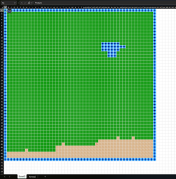

# xltm

xltm is a Python tool for creating csv tilemaps with corresponding image files from Excel files.

## Excel

Excel Desktop and Excel Web can be used to generate tilemaps by inserting [pictures in-cell](https://support.microsoft.com/en-us/office/insert-picture-in-cell-in-excel-e9317aee-4294-49a3-875c-9dd95845bab0).



## Images

All images are output to the working directory named with unique ids:
```
0.png
1.png
2.jpeg
4.jpg
```
Ids are unique non-negative integers that may not be contiguous.

Extensions depend on the source format of the image in Excel.

## Sheets

Each sheet is output to the working directory as a csv file with the same name:
```
forest1.csv
forest2.csv
```

Each entry in the csv file corresponds to an image id:
```
0,0,0,0,0
0,1,1,2,0
0,2,2,4,0
1,1,1,1,2
```

Empty entries have no image:
```
0,0,0,,0
0,,1,2,0
0,2,,4,0
,,,,
```
## Usage

xltm is invoked via the command line:

```console
python xltm.py example.xlsx
```

The first parameter is the path of the Excel file to process.

All output files are written to the working directory.

If the first parameter is omitted then no outputs are generated.

## Requirements

xltm is active on Python 3.13.

It is not compatible with Python < 3.8.

It is untested on 3.8 >= Python < 3.13.

There are no dependencies.

## Authors

[Ian Edwards](mailto:ian.contact@proton.me)

## License

This project is licensed under the [MIT License](https://opensource.org/license/MIT):

Copyright (c) 2024 Ian Edwards

Permission is hereby granted, free of charge, to any person obtaining a copy
of this software and associated documentation files (the "Software"), to deal
in the Software without restriction, including without limitation the rights
to use, copy, modify, merge, publish, distribute, sublicense, and/or sell
copies of the Software, and to permit persons to whom the Software is
furnished to do so, subject to the following conditions:

The above copyright notice and this permission notice shall be included in all
copies or substantial portions of the Software.

THE SOFTWARE IS PROVIDED "AS IS", WITHOUT WARRANTY OF ANY KIND, EXPRESS OR
IMPLIED, INCLUDING BUT NOT LIMITED TO THE WARRANTIES OF MERCHANTABILITY,
FITNESS FOR A PARTICULAR PURPOSE AND NONINFRINGEMENT. IN NO EVENT SHALL THE
AUTHORS OR COPYRIGHT HOLDERS BE LIABLE FOR ANY CLAIM, DAMAGES OR OTHER
LIABILITY, WHETHER IN AN ACTION OF CONTRACT, TORT OR OTHERWISE, ARISING FROM,
OUT OF OR IN CONNECTION WITH THE SOFTWARE OR THE USE OR OTHER DEALINGS IN THE
SOFTWARE.